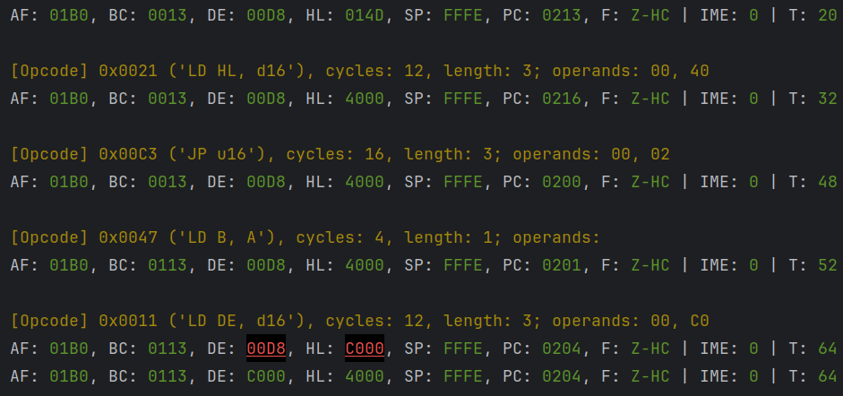

# Compare Gameboy logs
A dumb tool to compare two gameboy logs in order to debug a WIP emulator.

Expected format is a number of filler lines before alternating lines, one for the CPU status before next instruction execution, another for the opcode to be executed:
For example,

```
Loaded game title: '^@^@^@^@^@^@^@^@^@^@^@^@^@^@^@'
Cardridge type: '1'
AF: 01B0, BC: 0013, DE: 00D8, HL: 014D, SP: FFFE, PC: 0100, F: Z-HC | IME: 0 | T: 0
[Opcode] 0x0000 ('NOP'), cycles: 4, length: 1; operands: 
AF: 01B0, BC: 0013, DE: 00D8, HL: 014D, SP: FFFE, PC: 0101, F: Z-HC | IME: 0 | T: 4
[Opcode] 0x00C3 ('JP u16'), cycles: 16, length: 3; operands: 13, 02
AF: 01B0, BC: 0013, DE: 00D8, HL: 014D, SP: FFFE, PC: 0213, F: Z-HC | IME: 0 | T: 20
[Opcode] 0x0021 ('LD HL, d16'), cycles: 12, length: 3; operands: 00, 40
```

Sample output


Intented for debugging Blarrg's test ROMs.